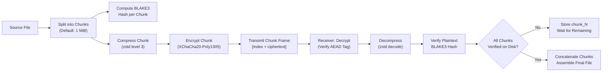
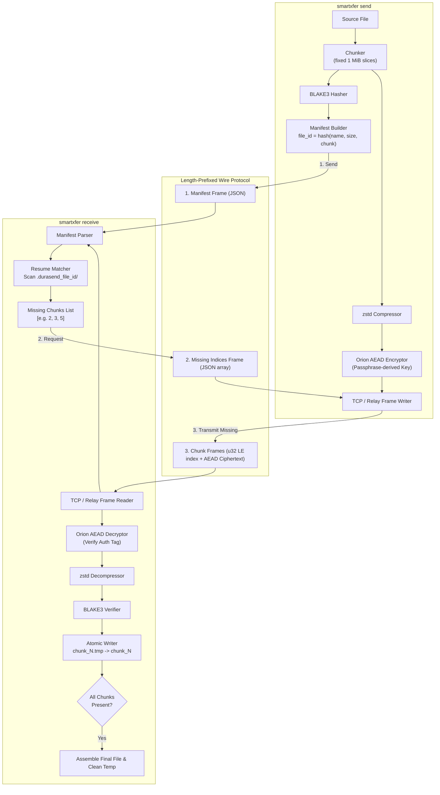
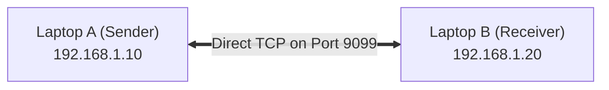
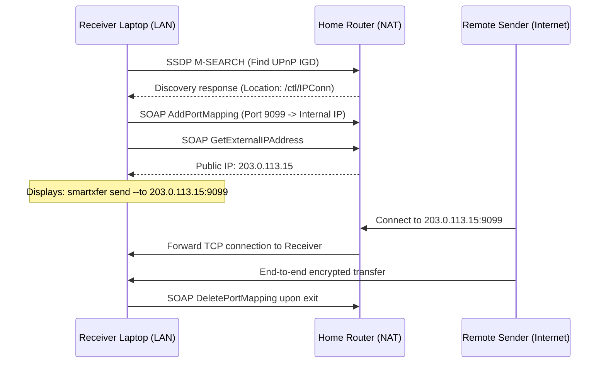
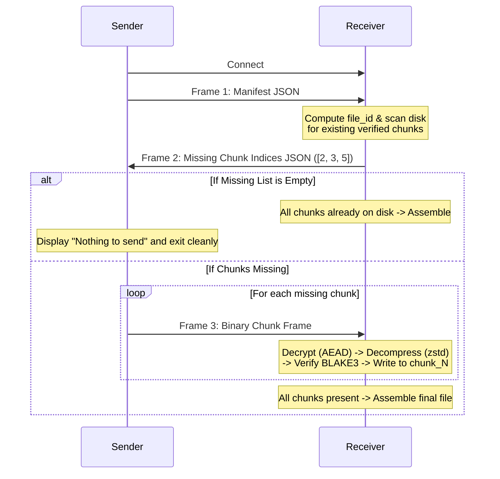

# SmartXfer (DuraSend)

[](https://www.rust-lang.org/)
[](https://github.com/brycx/orion)
[](https://github.com/BLAKE3-team/BLAKE3)
[](LICENSE)

> **Resilient, secure, chunk-resumable file transfer for unstable and remote networks.**  
> Built specifically for environments where connections drop mid-transfer and starting over is not an option: rural medical clinics, disaster relief zones, racetrack telemetry, mobile field teams, and cross-internet transfers behind NAT/firewalls.

---

## Key Features

- 🔄 **Resumable by default** — If a connection drops at any byte offset, re-running the identical command resumes from the exact missing chunk. No `--resume` flag, no session database, no special state to track.
- 🔐 **Zero-Knowledge End-to-End Encryption** — Chunks are encrypted with **XChaCha20-Poly1305 AEAD** via `orion`. Transports, intermediate routers, and relay servers never see plaintext or encryption keys.
- ✅ **Independent Per-Chunk Integrity** — Each chunk is hashed with **BLAKE3**. Corrupted chunks are rejected at the chunk level without discarding previously downloaded good chunks.
- 📦 **Compress-Then-Encrypt** — Payloads are compressed with **zstd** before encryption, saving bandwidth on low-throughput links without compromising ciphertext entropy.
- 🌐 **3 Flexible Network Topologies**:
  1. **Direct Offline LAN / Hotspot / Cable** — Pure point-to-point without internet, DNS, or cloud dependencies.
  2. **Automatic UPnP Port Mapping (`--upnp`)** — Automatically discovers your router, opens port 9099, and retrieves your public IP for direct internet transfers.
  3. **Encrypted Relay Mode (`--relay`)** — Traverses cellular 4G/5G, double-NAT, and corporate firewalls via an outbound-bridged relay server while keeping files 100% end-to-end encrypted.
- 📀 **Single Static Binary** — Zero runtime dependencies, no Python/Node/Java requirements on target machines.

---

## Table of Contents

- [How It Works](#how-it-works)
- [System Architecture](#system-architecture)
- [Network Topologies & Remote Transfers](#network-topologies--remote-transfers)
  - [Mode 1: Offline / Direct LAN Transfer](#mode-1-offline--direct-lan-transfer)
  - [Mode 2: Automatic UPnP Router Port Forwarding](#mode-2-automatic-upnp-router-port-forwarding)
  - [Mode 3: Zero-Knowledge Encrypted Relay](#mode-3-zero-knowledge-encrypted-relay)
- [Step-by-Step Instruction Guide](#step-by-step-instruction-guide)
  - [Guide 1: Quick Loopback Test on a Single Laptop](#guide-1-quick-loopback-test-on-a-single-laptop)
  - [Guide 2: Testing the Network Crash & Instant Resume](#guide-2-testing-the-network-crash--instant-resume)
  - [Guide 3: Transferring Between Two Laptops on the Same Wi-Fi](#guide-3-transferring-between-two-laptops-on-the-same-wi-fi)
  - [Guide 4: Transferring Over the Internet with UPnP](#guide-4-transferring-over-the-internet-with-upnp)
  - [Guide 5: Transferring Over Remote Networks with the Relay](#guide-5-transferring-over-remote-networks-with-the-relay)
- [Wire Protocol Specification](#wire-protocol-specification)
  - [Framing Protocol](#framing-protocol)
  - [Manifest Schema](#manifest-schema)
  - [Binary Chunk Frame Layout](#binary-chunk-frame-layout)
- [Resilience & Resume Mechanics](#resilience--resume-mechanics)
- [CLI Reference](#cli-reference)
  - [`send`](#send)
  - [`receive`](#receive)
  - [`relay`](#relay)
- [Security & Threat Model](#security--threat-model)
- [Build & Installation](#build--installation)
  - [Dependency Pinning Notes](#dependency-pinning-notes)
- [Project Structure](#project-structure)
- [Roadmap](#roadmap)

---

## How It Works

Files are divided into fixed-size chunks (default **1 MiB**). Each chunk undergoes independent hashing, compression, and AEAD encryption. 

The receiver tracks verified chunks in a content-addressed directory on disk (`.durasend_<file_id>/`). When a transfer starts or restarts, the receiver compares what is already verified on disk against the sender's manifest and requests **only the missing chunk indices**.



---

## System Architecture

The following diagram illustrates how the Sender, Wire Protocol, and Receiver interact during a transfer:



### Module Responsibilities

| Module | Source File | Responsibility |
|---|---|---|
| `manifest` | [`src/manifest.rs`](src/manifest.rs) | File identification, chunk slicing, BLAKE3 per-chunk hashing, and `file_id` derivation |
| `crypto` | [`src/crypto.rs`](src/crypto.rs) | Symmetric key derivation and Orion XChaCha20-Poly1305 AEAD seal/open routines |
| `protocol` | [`src/protocol.rs`](src/protocol.rs) | Length-prefixed wire framing (`[u32 LE length][payload]`) and binary chunk framing |
| `relay` | [`src/relay.rs`](src/relay.rs) | High-performance TCP bridging relay server, session derivation, and client pairing |
| `upnp` | [`src/upnp.rs`](src/upnp.rs) | SSDP UDP multicast gateway discovery, UPnP IGD port mapping, and public IP lookup |
| `runner` | [`src/runner.rs`](src/runner.rs) | CLI command parsing, transfer state machines, atomic writes, and file assembly |
| `binaries` | [`src/bin/`](src/bin/) | Dual CLI entry points: `smartxfer` and `durasend` |

---

## Network Topologies & Remote Transfers

SmartXfer is engineered to adapt to different network conditions:

### Mode 1: Offline / Direct LAN Transfer
For local facilities, field networks, and disaster relief zones without internet access.
- Both devices connect over the same local Wi-Fi, Ethernet patch cable, or smartphone Wi-Fi hotspot.
- Pure peer-to-peer TCP connection directly between the two local IPs.



---

### Mode 2: Automatic UPnP Router Port Forwarding
For direct P2P transfers over the public Internet between homes or offices.
- Receiver passes `--upnp`.
- SmartXfer sends an SSDP discovery packet to the local router, maps TCP port `9099`, and queries the router for its public IP address (e.g. `203.0.113.15`).
- The remote sender connects directly to `203.0.113.15:9099`.
- When the receiver completes or terminates, it automatically unmaps the port from the router.



---

### Mode 3: Zero-Knowledge Encrypted Relay
For scenarios where both devices are behind strict firewalls, double-NAT, carrier-grade NAT (cellular 4G/5G mobile data), or university/hospital networks.
- A public host runs `smartxfer relay --listen 0.0.0.0:9099`.
- Both Receiver and Sender establish **outbound** TCP connections to the relay.
- Each client sends a 17-byte session registration: `[role][16-byte session_token]`, where `session_token = blake3("smartxfer_relay_session_v1:" + passphrase)`.
- The relay pairs the two sockets and bridges them bi-directionally.
- **Relay Zero-Knowledge Security:** All data transmitted through the relay is encrypted with Orion XChaCha20-Poly1305 AEAD. The relay server never sees keys, cannot inspect data, and cannot tamper with chunks.

```mermaid
flowchart LR
    subgraph SenderSite["Sender Site (Behind Cellular / CGNAT)"]
        S["Sender Laptop"]
    end

    subgraph CloudHost["Public Internet Server"]
        Relay["smartxfer relay<br/>relay.example.com:9099"]
    end

    subgraph ReceiverSite["Receiver Site (Behind Hospital / Corporate NAT)"]
        R["Receiver Laptop"]
    end

    S -- "Outbound TCP: Connect & Pair" --> Relay
    R -- "Outbound TCP: Register & Wait" --> Relay
    Relay -. "Bridges Opaque Ciphertext .-" S
    Relay -. "Bridges Opaque Ciphertext .-" R
```

---

## Step-by-Step Instruction Guide

### Guide 1: Quick Loopback Test on a Single Laptop

1. Open **Terminal 1** and start the receiver:
   ```powershell
   smartxfer receive --listen 127.0.0.1:9099 --out-dir ./downloads --passphrase "mysecret123"
   ```
2. Open **Terminal 2** and send a test file:
   ```powershell
   # Create a test file
   "Hello from SmartXfer!" | Out-File -FilePath hello.txt

   # Send to the receiver
   smartxfer send hello.txt --to 127.0.0.1:9099 --passphrase "mysecret123"
   ```
3. Check `downloads/hello.txt` to verify the file was received and reassembled.

---

### Guide 2: Testing the Network Crash & Instant Resume

SmartXfer comes with a `--simulate-flaky` flag that deliberately drops the connection mid-transfer so you can verify the resume mechanics:

1. Generate a 5 MB test file in **Terminal 2**:
   ```powershell
   python -c "with open('patient_records.bin', 'wb') as f: f.write(b'X' * 5 * 1024 * 1024)"
   ```
2. Run `send` with `--simulate-flaky`:
   ```powershell
   smartxfer send patient_records.bin --to 127.0.0.1:9099 --passphrase "mysecret123" --simulate-flaky
   ```
   **Output:**
   ```text
   [smartxfer] Sent chunk 1/5 (index: 0...)
   [smartxfer] [FLAKY SIMULATION] Intentionally killing connection after sending 1 chunk(s).
   ```
3. Re-run the exact same command (without the simulation flag):
   ```powershell
   smartxfer send patient_records.bin --to 127.0.0.1:9099 --passphrase "mysecret123"
   ```
   **Output:**
   ```text
   [smartxfer] Receiver requested 4 missing chunk(s) out of 5 total.
   [smartxfer] Sent chunk 1/4 (index: 1...)
   [smartxfer] Sent chunk 2/4 (index: 2...)
   [smartxfer] Sent chunk 3/4 (index: 3...)
   [smartxfer] Sent chunk 4/4 (index: 4...)
   [smartxfer] All requested chunks sent successfully!
   ```
   Notice that **Chunk 0 was never re-sent**! The receiver kept chunk 0 on disk and only requested the missing chunks.

---

### Guide 3: Transferring Between Two Laptops on the Same Wi-Fi

1. **Find the Receiver's IP Address** (on Laptop A):
   - Windows: Run `ipconfig` (find your `IPv4 Address`, e.g., `192.168.1.45`)
   - macOS / Linux: Run `ifconfig` or `ip a`
2. **On Laptop A (Receiver):**
   ```bash
   smartxfer receive --listen 0.0.0.0:9099 --out-dir ./received --passphrase "fieldpass"
   ```
3. **On Laptop B (Sender):**
   ```bash
   smartxfer send ./records.tar --to 192.168.1.45:9099 --passphrase "fieldpass"
   ```

---

### Guide 4: Transferring Over the Internet with UPnP

1. **On Receiver (Home/Office Laptop behind router):**
   ```bash
   smartxfer receive --listen 0.0.0.0:9099 --upnp --out-dir ./received --passphrase "remotepass"
   ```
   SmartXfer prints:
   ```text
   [upnp] Router port 9099 successfully opened via UPnP!
   [upnp] Public IP Address: 203.0.113.88
   ```
2. **On Remote Sender (Anywhere in the world):**
   ```bash
   smartxfer send ./dataset.zip --to 203.0.113.88:9099 --passphrase "remotepass"
   ```

---

### Guide 5: Transferring Over Remote Networks with the Relay

1. **Start the Relay on any public VPS or server:**
   ```bash
   smartxfer relay --listen 0.0.0.0:9099
   ```
2. **On the Receiver (behind firewall or mobile hotspot):**
   ```bash
   smartxfer receive --relay relay.example.com:9099 --out-dir ./received --passphrase "remotepass"
   ```
3. **On the Sender (behind another network or mobile hotspot):**
   ```bash
   smartxfer send ./dataset.zip --relay relay.example.com:9099 --passphrase "remotepass"
   ```

---

## Wire Protocol Specification

All communication occurs over a single TCP connection per attempt. Every message uses length-prefixed framing.

### Framing Protocol
Every message frame starts with a 4-byte little-endian length prefix followed by the payload bytes:
```text
+-----------------------+-----------------------------+
| Payload Length: 4B LE | Payload Bytes (Length bytes)|
+-----------------------+-----------------------------+
```



### Manifest Schema
Transmitted as a JSON frame:
```json
{
  "file_name": "clinic_batch_2026.tar.zst",
  "file_size": 6291456,
  "chunk_size": 1048576,
  "chunk_hashes": [
    "3f7a1c5d...",
    "a8e4b2f1...",
    "7c0e9d4a..."
  ],
  "file_id": "04436cfa2ec925585fdc3724a534c860605c62b9f964db5f7896645374afa153"
}
```

### Binary Chunk Frame Layout
Chunk payloads use a compact binary format to avoid Base64 encoding overhead:
```text
+---------------------+------------------------------------------------+
| Chunk Index (4B LE) | Orion AEAD Ciphertext (Nonce + Tag + Payload)  |
+---------------------+------------------------------------------------+
```
*(Orion embeds its own internal nonce and authentication tag inside the ciphertext; no separate nonce field is required.)*

---

## Resilience & Resume Mechanics

### Content-Addressed Transfer State
Transfer identity is derived from the file itself:
$$\text{file\_id} = \text{BLAKE3}(\text{file\_name} : \text{file\_size} : \text{chunk\_size})$$

On the receiver side, incoming chunks are stored in:
```text
<out_dir>/.durasend_<file_id>/
├── manifest.json
├── chunk_0
├── chunk_1
└── chunk_4
```

### Atomic Chunk Verification & Writing
1. A chunk file is only named `chunk_N` after its decrypted plaintext has been verified against `manifest.chunk_hashes[N]`.
2. Plaintext is written to `chunk_N.tmp` and flushed to disk before being atomically renamed to `chunk_N`.
3. An interrupted write never leaves a corrupted chunk file on disk.
4. When all chunks `0` through `N-1` are present, the receiver concatenates the chunks in index order into `<out_dir>/<file_name>` and deletes the temporary directory.

---

## CLI Reference

### `send`
```text
Usage: smartxfer send [OPTIONS] --passphrase <PASSPHRASE> <FILE>

Arguments:
  <FILE>  Path to the file to transfer

Options:
      --to <TO>                  Direct receiver address (host:port)
      --relay <RELAY>            Relay server address for NAT/firewall traversal (host:port)
      --passphrase <PASSPHRASE>  Shared secret passphrase for AEAD encryption
      --chunk-size <CHUNK_SIZE>  Bytes per chunk (default: 1048576 = 1 MiB)
      --simulate-flaky           Testing aid: deliberately drops connection partway through to test resume
  -h, --help                     Print help
```

### `receive`
```text
Usage: smartxfer receive [OPTIONS] --out-dir <OUT_DIR> --passphrase <PASSPHRASE>

Options:
      --listen <LISTEN>          Bind address for direct connections (host:port)
      --relay <RELAY>            Relay server address for NAT/firewall traversal (host:port)
      --upnp                     Enable UPnP automatic router port mapping and external IP discovery
      --out-dir <OUT_DIR>        Directory where completed files and resume state live
      --passphrase <PASSPHRASE>  Shared secret passphrase for AEAD decryption
  -h, --help                     Print help
```

### `relay`
```text
Usage: smartxfer relay [OPTIONS]

Options:
      --listen <LISTEN>  Bind address for the relay (host:port) [default: 0.0.0.0:9099]
  -h, --help             Print help
```

---

## Security & Threat Model

| Security Property | Mechanism | Status |
|---|---|---|
| **Confidentiality in Transit** | XChaCha20-Poly1305 AEAD per chunk (`orion`) | ✅ Enforced |
| **Per-Chunk Integrity** | BLAKE3 hash verified before write | ✅ Enforced |
| **Whole-File Integrity** | Implied by all chunk hashes matching the manifest | ✅ Enforced |
| **Authentication Tag** | Orion includes and verifies 16-byte Poly1305 auth tag | ✅ Enforced |
| **Relay Zero-Knowledge** | Relay only forwards ciphertext without seeing keys | ✅ Enforced |
| **Key Derivation** | Raw BLAKE3 hash of passphrase | ⚠️ MVP Only (Argon2id on Roadmap) |
| **Forward Secrecy** | Static passphrase-derived key per transfer | ⚠️ Planned on Roadmap |

**Threat Model Summary:** SmartXfer protects file contents from passive network observers, malicious Wi-Fi access points, and compromised relay servers. The relay never possesses the secret key and cannot decrypt or modify the data.

---

## Build & Installation

### Prerequisites
- Rust 1.75+ (or any modern stable toolchain).

```bash
git clone https://github.com/Sonalhegde/durasend.git
cd durasend
cargo build --release
```

Compiled binaries are generated at:
- `target/release/smartxfer` (and `target/release/durasend`)

### Dependency Pinning Notes
Several crates in the cryptography ecosystem require the `edition2024` feature stabilized in Rust 1.85. To guarantee broad compatibility with older enterprise and Debian/Ubuntu toolchains (e.g., Rust 1.75), `Cargo.toml` pins:
- `zeroize = "=1.7.0"`
- `getrandom = "=0.2.15"`
- `clap = "=4.4.18"`
- `jobserver = "=0.1.32"`

If building on an older compiler, ensure `jobserver` remains pinned:
```bash
cargo update -p jobserver --precise 0.1.32
```

---

## Project Structure

```text
durasend/
├── Cargo.toml
├── Cargo.lock
├── README.md               <- Comprehensive documentation & guide
├── ARCHITECTURE.md         <- Detailed design rationale & decision log
├── test_runner.py          <- Automated resilience & flaky link test suite
└── src/
    ├── lib.rs              Library root exposing modules
    ├── runner.rs           CLI command orchestration, state machines, and assembly
    ├── manifest.rs         Manifest creation, BLAKE3 chunk hashing, file_id derivation
    ├── crypto.rs           Passphrase key derivation, Orion AEAD seal/open routines
    ├── protocol.rs         Length-prefixed framing and binary chunk payload framing
    ├── relay.rs            High-performance TCP bridging relay & session pairing
    ├── upnp.rs             UPnP IGD gateway discovery, port mapping & IP resolution
    └── bin/
        ├── smartxfer.rs    smartxfer executable
        └── durasend.rs     durasend executable
```

---

## Roadmap

1. **QUIC Transport Layer** — Swap TCP for `quinn` to eliminate head-of-line blocking on high-latency satellite/cellular links.
2. **Argon2id Key Derivation** — Upgrade the passphrase key derivation with high work factors and random manifest-carried salts.
3. **Delta-Sync for Modified Files** — Rolling checksums (rsync-style) to transfer only modified byte ranges within altered files.
4. **Autonomous P2P Hole Punching (`libp2p`)** — Automatic STUN/TURN/DERP direct P2P NAT traversal without manual relay configuration.
5. **Store-and-Forward SQLite Queue** — Offline spooling that flushes transfers automatically upon detecting connectivity.
6. **Desktop & Mobile GUI** — Lightweight cross-platform interface powered by Tauri and UniFFI mobile bindings.