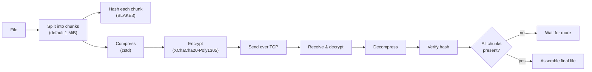
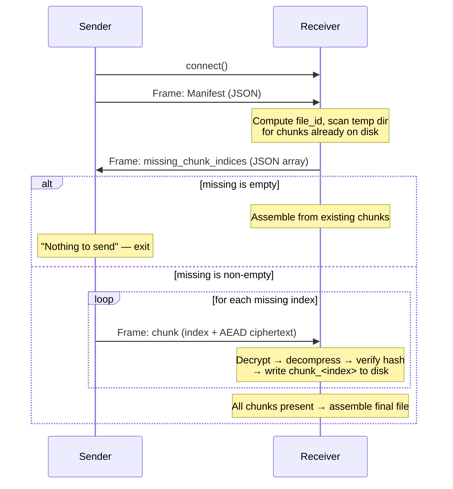
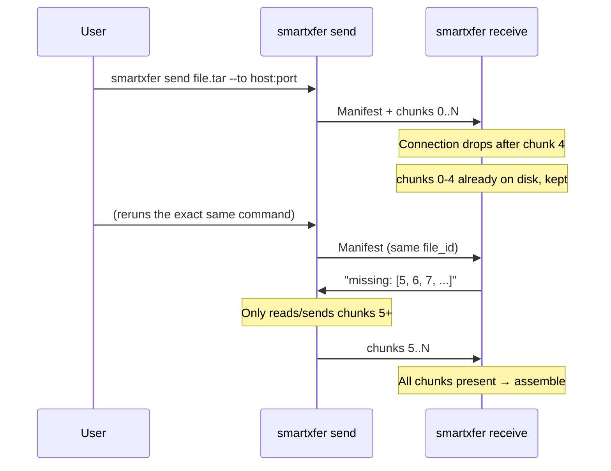

# SmartXfer (DuraSend)

> **Resilient, encrypted file transfer for unstable networks.**  
> Built for places where the connection drops mid-transfer and starting over isn't an option: rural clinics, disaster zones, racetrack telemetry, and anywhere else the network can't be trusted to stay up.

- 🔄 **Resumable by default** — kill the connection mid-transfer, rerun the same command, it picks up exactly where it left off. No `--resume` flag, no special mode.
- 🔐 **Encrypted end-to-end** — XChaCha20-Poly1305 AEAD per chunk, nothing readable on the wire or by a relay.
- ✅ **Integrity-checked per chunk** — BLAKE3 hashing catches corruption at the chunk level, not just at the end of a failed transfer.
- 📦 **Compressed before encrypted** — zstd shrinks the payload before it's sealed, so you're not paying bandwidth for entropy.
- 🌐 **Works fully offline** — direct TCP between two devices on the same local network, hotspot, or cable. No internet, no cloud server, no DNS required.
- 📀 **Single static binary** — no runtime, no package manager needed on the target machine.

---

## Table of Contents

- [How it works](#how-it-works)
- [Architecture](#architecture)
- [Wire protocol](#wire-protocol)
- [Resume flow](#resume-flow)
- [Install / Build](#install--build)
- [A note on dependency pinning](#a-note-on-dependency-pinning)
- [Usage](#usage)
- [Flags](#flags)
- [Security model](#security-model)
- [Offline / field deployment](#offline--field-deployment)
- [Roadmap](#roadmap)
- [Project structure](#project-structure)

---

## How it works

A file is split into fixed-size chunks (1 MiB by default). Each chunk is independently hashed, compressed, and encrypted. The receiver tracks which chunks it already has on disk for a given file, so if a transfer is interrupted, re-running it only sends what's missing — never the whole file again.



---

## Architecture


### Modules

| Module | File | Responsibility |
|---|---|---|
| `manifest` | `src/manifest.rs` | File identity: name, size, chunk hashes, `file_id` |
| `crypto` | `src/crypto.rs` | Key derivation + AEAD encrypt/decrypt (orion) |
| `protocol` | `src/protocol.rs` | Wire framing: length-prefixed frames, chunk encode/decode |
| `runner` | `src/runner.rs` | CLI, `send()`/`receive()` orchestration, resume logic |
| `main bins` | `src/bin/smartxfer.rs`, `src/bin/durasend.rs` | Executable entry points |

---

## Wire protocol

Single TCP connection per transfer attempt. Every message is a frame: `[u32 LE length][payload]`.



### Manifest (JSON)
```json
{
  "file_name": "patient_records_batch7.tar",
  "file_size": 6000000,
  "chunk_size": 1048576,
  "chunk_hashes": ["<blake3 hex>", "..."],
  "file_id": "<blake3 hex of name:size:chunk_size>"
}
```

### Chunk frame (binary)
```text
+----------------+----------------------------+
| index (u32 LE) | orion AEAD ciphertext      |
+----------------+----------------------------+
```
*(orion embeds its own nonce + auth tag in the ciphertext — no separate nonce field needed.)*

---

## Resume flow



No `--resume` flag exists on purpose — resuming is the default behavior of re-running `send`, not an opt-in mode. This avoids the failure mode where someone forgets a flag and unknowingly re-sends a whole file.

---

## Install / Build

Requires Rust (built and tested against Rust 1.75+).

```bash
git clone https://github.com/Sonalhegde/durasend.git
cd durasend
cargo build --release
# Binaries available at target/release/smartxfer (and target/release/durasend)
```

### A note on dependency pinning
Several crates in the encryption dependency chain require the `edition2024` Cargo feature (Rust ≥1.85). If you're on an older toolchain and hit edition2024 build errors, `Cargo.toml` already pins the known offenders (`zeroize`, `getrandom`, `clap`, `jobserver`) to MSRV-compatible versions — if `cargo build` still fails on a fresh checkout, run:
```bash
cargo update -p jobserver --precise 0.1.32
```
and re-pin any newly-surfaced transitive dependency the same way (`cargo tree -i <crate-name>` shows what's pulling it in).

---

## Usage

Start a receiver (leave this running — it accepts one transfer after another):
```bash
smartxfer receive --listen 0.0.0.0:9999 --out-dir ./received --passphrase "shared-secret"
```

Send a file:
```bash
smartxfer send ./patient_records.tar --to 192.168.1.50:9999 --passphrase "shared-secret"
```

Test resume behavior (deliberately drops the connection partway through, to verify a rerun resumes instead of restarting):
```bash
smartxfer send ./bigfile.bin --to 192.168.1.50:9999 --passphrase "shared-secret" --simulate-flaky
# rerun the identical command — it resumes automatically
smartxfer send ./bigfile.bin --to 192.168.1.50:9999 --passphrase "shared-secret"
```

---

## Flags

| Command | Flag | Required | Default | Purpose |
|---|---|---|---|---|
| `send` | `<FILE>` | ✅ | — | Path to the file to transfer |
| `send` | `--to` | ✅ | — | Receiver address, `host:port` |
| `send` | `--passphrase` | ✅ | — | Shared secret for key derivation |
| `send` | `--chunk-size` | ❌ | `1048576` | Bytes per chunk |
| `send` | `--simulate-flaky` | ❌ | `off` | Testing aid — deliberately drops connection to verify resume |
| `receive` | `--listen` | ✅ | — | Bind address, `host:port` |
| `receive` | `--out-dir` | ✅ | — | Where completed files and in-progress temp state live |
| `receive` | `--passphrase` | ✅ | — | Must match sender's passphrase |

---

## Security model

| Property | Mechanism | Status |
|---|---|---|
| Confidentiality in transit | XChaCha20-Poly1305 AEAD per chunk | ✅ |
| Per-chunk integrity | BLAKE3 hash, verified before a chunk is accepted | ✅ |
| Whole-file integrity | Implied by all chunk hashes matching the manifest | ✅ |
| Authentication tag | orion's `seal`/`open` includes and checks it | ✅ |
| Key derivation | Raw BLAKE3 of passphrase — no salt, no work factor | ⚠️ MVP only |
| Transport peer auth | None — any TCP peer can attempt to connect | ⚠️ Not yet implemented |
| Forward secrecy | None — static passphrase-derived key per transfer | ⚠️ Not yet implemented |

**Honest threat model:** this protects file contents from a passive network observer or a relay that doesn't know the passphrase. It does not yet protect against offline brute-forcing of a captured ciphertext (no KDF work factor) or an active man-in-the-middle. Argon2id key derivation is the top security item on the roadmap.

---

## Offline / field deployment

This is the core use case, not an edge case. `smartxfer` needs local network connectivity between two devices — no internet required:
- Two laptops on the same LAN/WiFi (even with no internet uplink)
- Direct ethernet or USB-tether cable
- A WiFi hotspot with no internet backhaul — one device hosts it
- An ad-hoc/mesh WiFi network with no router at all

### Field example (disaster zone):
```bash
# Device A hosts a WiFi hotspot with no internet, then:
smartxfer receive --listen 0.0.0.0:9999 --out-dir ./incoming --passphrase "site-alpha"

# Device B joins that hotspot, then:
smartxfer send ./report.tar --to 192.168.4.1:9999 --passphrase "site-alpha"
```

**Current limitation:** direct point-to-point only — the sender needs to know the receiver's reachable IP:port. There's no NAT traversal or relay yet for devices on separate isolated networks; that's the P2P/relay roadmap item below.

---

## Roadmap

1. **QUIC transport** — swap TCP for `quinn`; resume/manifest logic is already transport-agnostic so this is a lower-layer swap, not a rewrite.
2. **Argon2id key derivation** with a random salt in the manifest.
3. **Delta-sync for modified files** (rsync-style rolling checksums) — re-syncing an updated telemetry log sends only the changed bytes.
4. **P2P + relay fallback** (`libp2p`) for devices with no direct route.
5. **Local mesh mode** for racetrack telemetry — many nearby nodes relaying for each other.
6. **Store-and-forward queue** (SQLite-backed) — `send` queues locally when no receiver is currently reachable and flushes automatically.
7. **GUI / mobile wrapping** — Tauri for desktop, UniFFI bindings for mobile, once the core engine is stable.

---

## Project structure

```text
durasend/
├── Cargo.toml
├── Cargo.lock
├── README.md               <- this file
├── ARCHITECTURE.md         <- detailed design rationale & decision log
├── test_runner.py          <- automated resilience & flaky link test suite
└── src/
    ├── lib.rs              Library root exposing modules
    ├── runner.rs           CLI, send()/receive() orchestration, resume logic
    ├── manifest.rs         Manifest struct, file_id derivation
    ├── crypto.rs           Key derivation, AEAD encrypt/decrypt (orion)
    ├── protocol.rs         Wire framing: length-prefixed frames, chunk encode/decode
    └── bin/
        ├── smartxfer.rs    Entry point binary (smartxfer)
        └── durasend.rs     Entry point binary (durasend)
```

See [ARCHITECTURE.md](ARCHITECTURE.md) for the full design rationale, including why each dependency was chosen and the build issues encountered along the way.