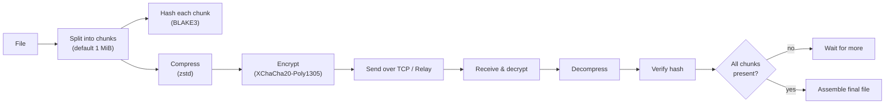
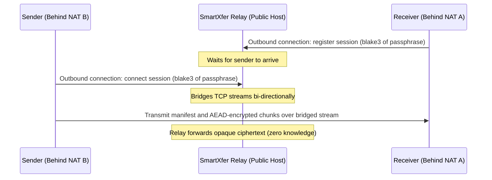
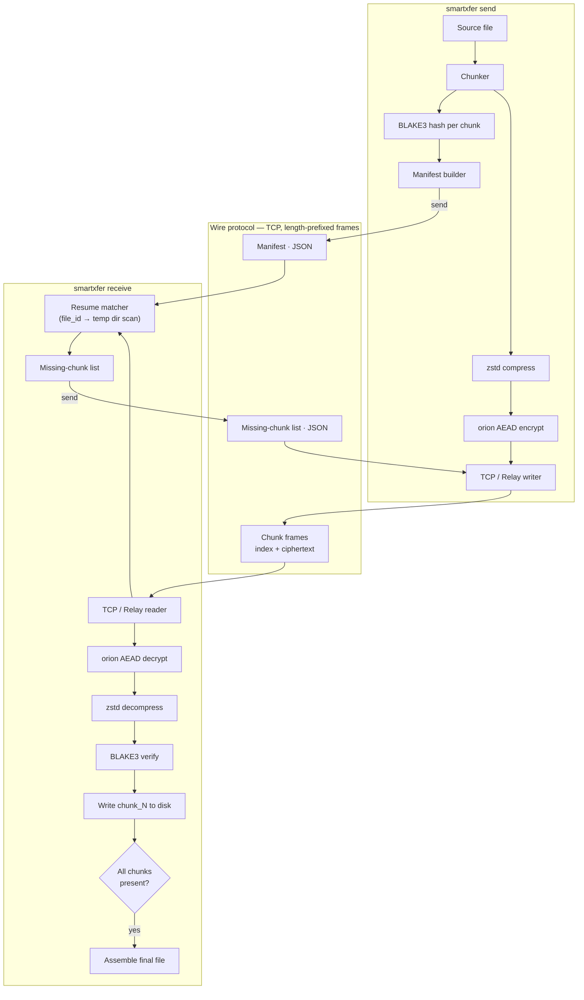
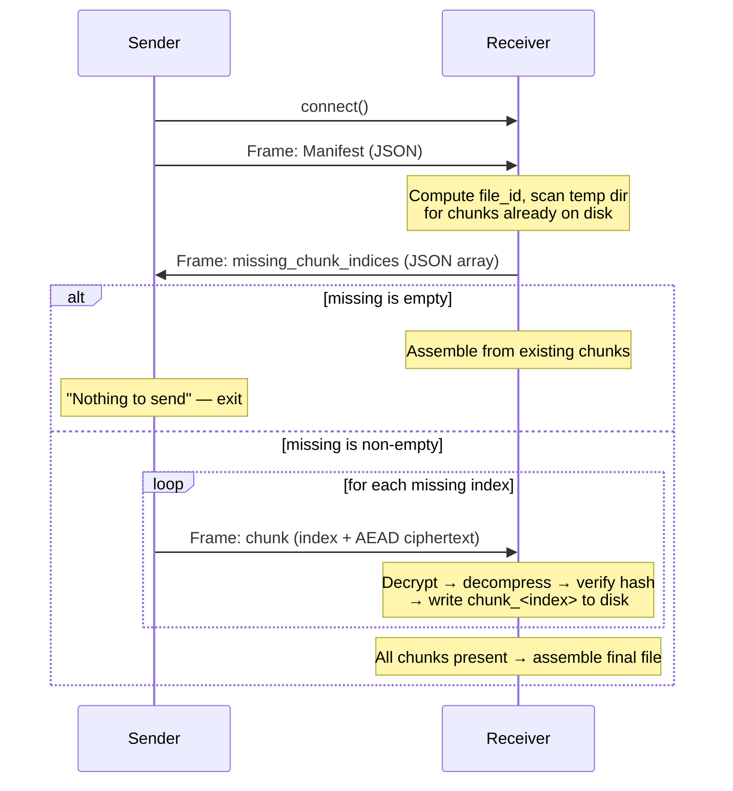
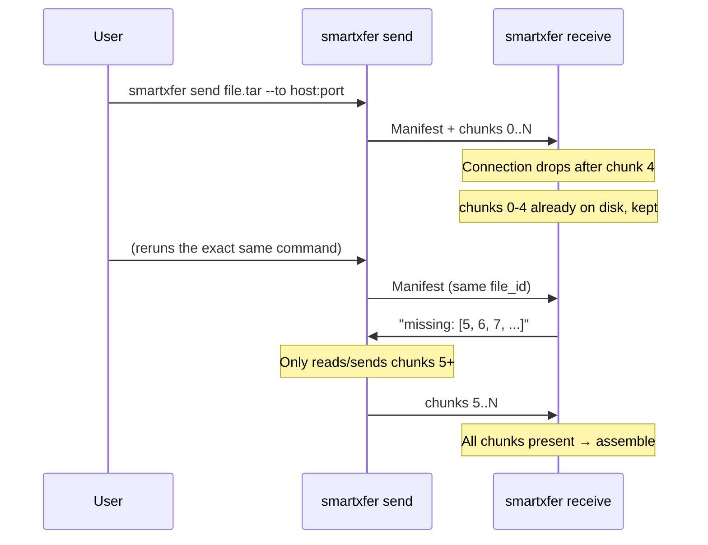

# SmartXfer (DuraSend)

> **Resilient, encrypted file transfer for unstable and remote networks.**  
> Built for places where the connection drops mid-transfer and starting over isn't an option: rural clinics, disaster zones, racetrack telemetry, remote field operations, and cross-internet transfers.

- 🔄 **Resumable by default** — kill the connection mid-transfer, rerun the same command, it picks up exactly where it left off. No `--resume` flag, no special mode.
- 🔐 **Encrypted end-to-end** — XChaCha20-Poly1305 AEAD per chunk, nothing readable on the wire or by a relay.
- ✅ **Integrity-checked per chunk** — BLAKE3 hashing catches corruption at the chunk level, not just at the end of a failed transfer.
- 📦 **Compressed before encrypted** — zstd shrinks the payload before it's sealed, so you're not paying bandwidth for entropy.
- 🌐 **Works across ANY network** — direct local LAN, ad-hoc hotspot, automatic UPnP router port forwarding, or zero-config end-to-end encrypted relay for remote connections across firewalls.
- 📀 **Single static binary** — no runtime, no package manager needed on the target machine.

---

## Table of Contents

- [How it works](#how-it-works)
- [Remote Network Options](#remote-network-options)
  - [Option 1: Automatic UPnP Router Port Forwarding](#option-1-automatic-upnp-router-port-forwarding)
  - [Option 2: Zero-Config End-to-End Encrypted Relay](#option-2-zero-config-end-to-end-encrypted-relay)
- [Architecture](#architecture)
- [Wire protocol](#wire-protocol)
- [Resume flow](#resume-flow)
- [Install / Build](#install--build)
- [A note on dependency pinning](#a-note-on-dependency-pinning)
- [Usage](#usage)
- [Flags](#flags)
- [Security model](#security-model)
- [Offline / field deployment](#offline--field-deployment)
- [Roadmap](#roadmap)
- [Project structure](#project-structure)

---

## How it works

A file is split into fixed-size chunks (1 MiB by default). Each chunk is independently hashed, compressed, and encrypted. The receiver tracks which chunks it already has on disk for a given file, so if a transfer is interrupted, re-running it only sends what's missing — never the whole file again.



---

## Remote Network Options

SmartXfer supports both direct LAN transfers and two remote network traversal methods:

### Option 1: Automatic UPnP Router Port Forwarding
If you are behind a home or office router with UPnP enabled, SmartXfer can automatically ask your router to open a port and query your public IP address.

1. **Receiver starts with `--upnp`:**
   ```bash
   smartxfer receive --listen 0.0.0.0:9099 --upnp --out-dir ./received --passphrase "shared-secret"
   ```
   SmartXfer discovers the router, maps port 9099, and prints your public IP:
   ```text
   [upnp] Router port 9099 successfully opened via UPnP!
   [upnp] Public IP Address: 203.0.113.45
   [upnp] Remote senders can transfer via: smartxfer send <FILE> --to 203.0.113.45:9099 --passphrase "..."
   ```

2. **Remote sender connects directly over the Internet:**
   ```bash
   smartxfer send ./records.tar --to 203.0.113.45:9099 --passphrase "shared-secret"
   ```
   *(When the receiver finishes or exits, it automatically unmaps the port from your router.)*

---

### Option 2: Zero-Config End-to-End Encrypted Relay
For devices behind cellular 4G/5G, double-NAT, university/corporate firewalls, or routers without UPnP, SmartXfer includes a built-in **zero-knowledge TCP relay**. Both devices make an outgoing connection to the relay server.



1. **Run a relay (on any VPS, cloud server, or accessible machine):**
   ```bash
   smartxfer relay --listen 0.0.0.0:9099
   ```

2. **Receiver connects to the relay:**
   ```bash
   smartxfer receive --relay relay.example.com:9099 --out-dir ./received --passphrase "shared-secret"
   ```

3. **Sender connects to the same relay:**
   ```bash
   smartxfer send ./file.zip --relay relay.example.com:9099 --passphrase "shared-secret"
   ```

> [!NOTE]
> **Complete End-to-End Security:** The relay server only forwards raw bytes. It never has access to the passphrase or encryption keys, meaning the relay cannot decrypt, inspect, or tamper with any file data.

---

## Architecture



### Modules

| Module | File | Responsibility |
|---|---|---|
| `manifest` | `src/manifest.rs` | File identity: name, size, chunk hashes, `file_id` |
| `crypto` | `src/crypto.rs` | Key derivation + AEAD encrypt/decrypt (orion) |
| `protocol` | `src/protocol.rs` | Wire framing: length-prefixed frames, chunk encode/decode |
| `relay` | `src/relay.rs` | Lightweight TCP bridging relay with session matching |
| `upnp` | `src/upnp.rs` | SSDP discovery, UPnP IGD port mapping & public IP resolution |
| `runner` | `src/runner.rs` | CLI orchestration, resume logic, and transfer pipelines |
| `main bins` | `src/bin/smartxfer.rs`, `src/bin/durasend.rs` | Executable entry points |

---

## Wire protocol

Single TCP connection per transfer attempt. Every message is a frame: `[u32 LE length][payload]`.



---

## Resume flow



No `--resume` flag exists on purpose — resuming is the default behavior of re-running `send`, not an opt-in mode.

---

## Install / Build

Requires Rust (built and tested against Rust 1.75+).

```bash
git clone https://github.com/Sonalhegde/durasend.git
cd durasend
cargo build --release
# Binaries available at target/release/smartxfer (and target/release/durasend)
```

---

## Flags

### `send`
| Flag | Required | Default | Purpose |
|---|---|---|---|
| `<FILE>` | ✅ | — | Path to the file to transfer |
| `--to` | Conditional | — | Direct receiver address (`host:port`) |
| `--relay` | Conditional | — | Remote relay server address (`host:port`) |
| `--passphrase` | ✅ | — | Shared secret for AEAD encryption |
| `--chunk-size` | ❌ | `1048576` | Bytes per chunk (1 MiB default) |
| `--simulate-flaky` | ❌ | `off` | Testing aid: deliberately drops connection to test resume |

### `receive`
| Flag | Required | Default | Purpose |
|---|---|---|---|
| `--listen` | Conditional | — | Bind address for direct LAN connections |
| `--relay` | Conditional | — | Remote relay server address (`host:port`) |
| `--upnp` | ❌ | `false` | Enable automatic router port mapping and public IP lookup |
| `--out-dir` | ✅ | — | Where completed files and in-progress temp state live |
| `--passphrase` | ✅ | — | Must match sender's passphrase |

### `relay`
| Flag | Required | Default | Purpose |
|---|---|---|---|
| `--listen` | ❌ | `0.0.0.0:9099` | Bind address for the relay server |

---

## Security model

| Property | Mechanism | Status |
|---|---|---|
| Confidentiality in transit | XChaCha20-Poly1305 AEAD per chunk | ✅ |
| Per-chunk integrity | BLAKE3 hash, verified before a chunk is accepted | ✅ |
| Whole-file integrity | Implied by all chunk hashes matching the manifest | ✅ |
| Authentication tag | orion's `seal`/`open` includes and checks it | ✅ |
| Relay Zero-Knowledge | Relay only forwards ciphertext without seeing keys | ✅ |
| Key derivation | Raw BLAKE3 of passphrase — no salt, no work factor | ⚠️ MVP only |
| Forward secrecy | None — static passphrase-derived key per transfer | ⚠️ Not yet implemented |

---

## Project structure

```text
durasend/
├── Cargo.toml
├── Cargo.lock
├── README.md               <- this file
├── ARCHITECTURE.md         <- detailed design rationale & decision log
├── test_runner.py          <- automated resilience & flaky link test suite
└── src/
    ├── lib.rs              Library root exposing modules
    ├── runner.rs           CLI orchestration, resume logic, transfer workflows
    ├── manifest.rs         Manifest struct, file_id derivation
    ├── crypto.rs           Key derivation, AEAD encrypt/decrypt (orion)
    ├── protocol.rs         Wire framing: length-prefixed frames, chunk encode/decode
    ├── relay.rs            Built-in TCP bridging relay with session matching
    ├── upnp.rs             UPnP IGD router port forwarder and public IP query
    └── bin/
        ├── smartxfer.rs    Entry point binary (smartxfer)
        └── durasend.rs     Entry point binary (durasend)
```