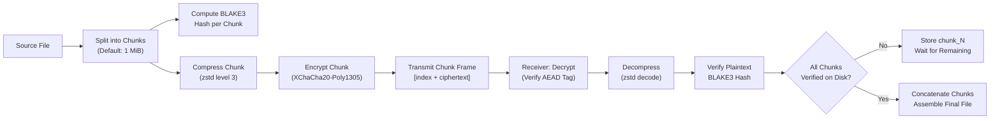
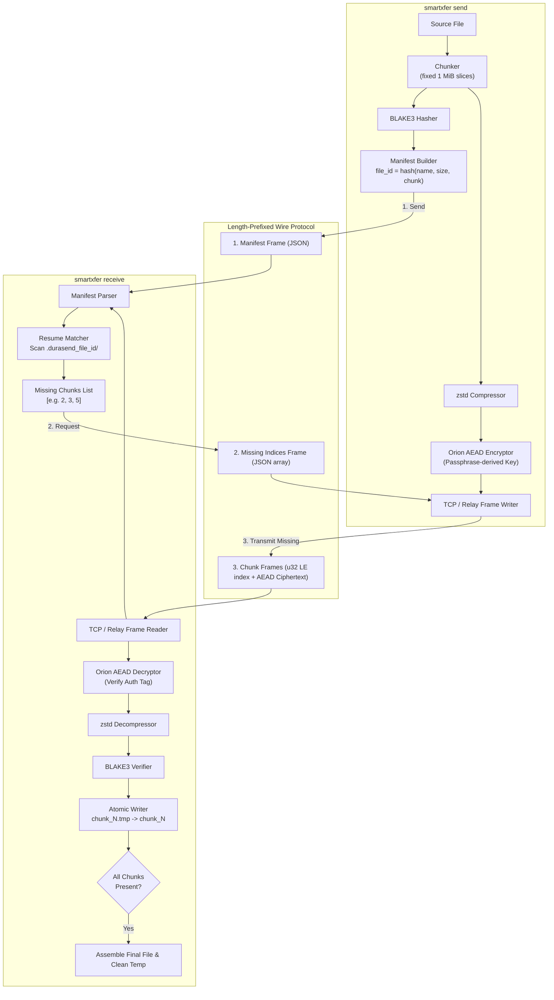
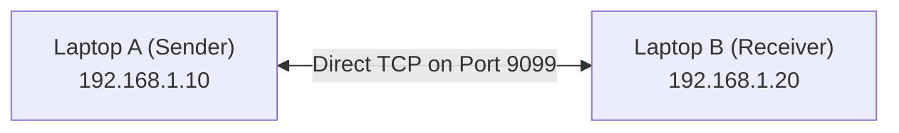
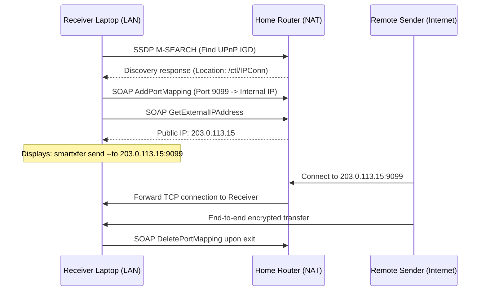
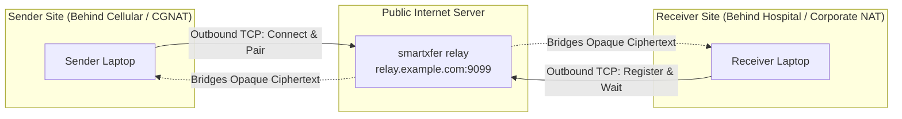
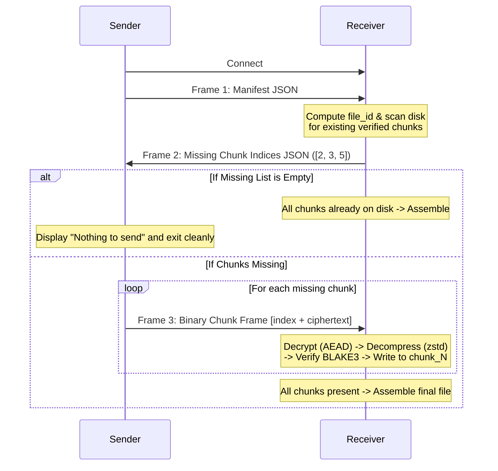

# SmartXfer

[](https://www.rust-lang.org/)
[](https://github.com/brycx/orion)
[](https://github.com/BLAKE3-team/BLAKE3)
[](LICENSE)

Standard file transfer tools (`scp`, `rsync`, HTTP upload, cloud buckets) make a fatal assumption that fails in hostile network environments: they assume stable connections, persistent server sessions, or cloud accounts. On rural medical clinic satellite uplinks with hours of downtime, in disaster relief zones with damaged infrastructure, or on high-vibration racetrack telemetry rigs, a dropped connection means either restarting a multi-gigabyte transfer from byte zero, risking silent bitrot corruption, or losing hours of progress because a process restart destroyed in-memory session tokens.

**SmartXfer** solves this by turning **the filesystem itself into the state store**. Instead of fragile session tokens or connection-tied state, transfer identity is derived purely from file identity:

$$\text{file\_id} = \text{BLAKE3}(\text{file\_name} : \text{file\_size} : \text{chunk\_size})$$

Files are split into fixed 1 MiB slices, each independently hashed with **BLAKE3**, compressed with **zstd**, and sealed with **XChaCha20-Poly1305 AEAD** before ever touching the wire. If a connection dies at any byte offset, re-running the identical command simply inspects the receiver's disk and transmits **only the missing chunks**. There is no `--resume` flag to remember, no coordination database, zero plaintext exposure even over untrusted public relays, and complete offline autonomy without internet or cloud accounts.

---

## Key Highlights

- [*] **Resumable by default** — Kill the connection at 99%, rerun the same command, it picks up exactly at the missing chunk. No special flags required.
- [*] **Zero-Knowledge AEAD Encryption** — End-to-end XChaCha20-Poly1305 encryption per chunk. Transports and relays see only opaque ciphertext.
- [*] **Independent Chunk Integrity** — BLAKE3 hashing catches corruption per 1 MiB chunk; one bad chunk never invalidates good chunks already saved.
- [*] **Compress-Then-Encrypt** — zstd level 3 compression precedes encryption, saving bandwidth on costly satellite and cellular links.
- [*] **3 Network Topologies** — Works offline over direct LAN/hotspot cable, over the internet via automatic UPnP router port mapping, or through a zero-knowledge relay across NAT/firewalls.
- [*] **Interactive ASCII Terminal UI with Dynamic RGB Themes** — Run `smartxfer` or `smartxfer ui` for a guided ASCII terminal menu with dynamic TrueColor RGB gradients that cycle on every launch and menu loop (Cyberpunk Neon, Synthwave Sunset, Matrix Emerald, Solar Flare, etc.), plus `smartxfer install` to add it to system PATH permanently.

---

## Table of Contents

- [How It Works](#how-it-works)
- [System Architecture](#system-architecture)
- [Network Topologies & Remote Transfers](#network-topologies--remote-transfers)
  - [Mode 1: Offline / Direct LAN Transfer](#mode-1-offline--direct-lan-transfer)
  - [Mode 2: Automatic UPnP Router Port Forwarding](#mode-2-automatic-upnp-router-port-forwarding)
  - [Mode 3: Zero-Knowledge Encrypted Relay](#mode-3-zero-knowledge-encrypted-relay)
- [Interactive Terminal UI & Installation](#interactive-terminal-ui--installation)
- [Step-by-Step Instruction Guide](#step-by-step-instruction-guide)
  - [Guide 1: Quick Loopback Test on a Single Laptop](#guide-1-quick-loopback-test-on-a-single-laptop)
  - [Guide 2: Testing the Network Crash & Instant Resume](#guide-2-testing-the-network-crash--instant-resume)
  - [Guide 3: Transferring Between Two Laptops on the Same Wi-Fi](#guide-3-transferring-between-two-laptops-on-the-same-wi-fi)
  - [Guide 4: Transferring Over the Internet with UPnP](#guide-4-transferring-over-the-internet-with-upnp)
  - [Guide 5: Transferring Over Remote Networks with the Relay](#guide-5-transferring-over-remote-networks-with-the-relay)
- [Wire Protocol Specification](#wire-protocol-specification)
- [CLI Reference](#cli-reference)
- [Security & Threat Model](#security--threat-model)
- [Build & Installation](#build--installation)
- [Project Structure](#project-structure)
- [Roadmap](#roadmap)

---

## How It Works

A file is split into fixed-size chunks (1 MiB by default). Each chunk is independently hashed, compressed, and encrypted. The receiver tracks verified chunks on disk for that `file_id`. If interrupted, re-running only transmits the gaps.



---

## System Architecture



---

## Network Topologies & Remote Transfers

### Mode 1: Offline / Direct LAN Transfer
Connect two devices directly over local Wi-Fi, Ethernet patch cable, or phone hotspot without internet, DNS, or servers.



---

### Mode 2: Automatic UPnP Router Port Forwarding
If you are behind a home or office router, `--upnp` tells SmartXfer to open the port on your router and find your public IP automatically.



---

### Mode 3: Zero-Knowledge Encrypted Relay
For devices behind cellular 4G/5G, double-NAT, or corporate firewalls where ports cannot be opened. Both devices connect **outbound** to a relay server.



---

## Interactive Terminal UI & Installation

### ASCII-Themed Interactive Menu with Dynamic RGB Palettes
Run `smartxfer` with no arguments, or run `smartxfer ui` to launch the guided ASCII terminal interface. It features **dynamic 24-bit TrueColor RGB gradients** that automatically shift to a fresh palette every time you open the program or loop back to the menu:

```text
+============================================================+
|   ____  __  __    _    ____ _____ __  ______ _____ ____    |
|  / ___||  \/  |  / \  |  _ \_   _|\ \/ /  ___| ____|  _ \   |
|  \___ \| |\/| | / _ \ | |_) || |   \  /| |_  |  _| | |_) |  |
|   ___) | |  | |/ ___ \|  _ < | |   /  \|  _|| |___|  _ <   |
|  |____/|_|  |_/_/   \_\_| \_\|_|  /_/\_\_|   |_____|_| \_\  |
|------------------------------------------------------------|
|     Resilient - Encrypted - Autonomous File Transfer Suite     |
|               [ RGB Palette: Cyberpunk Neon ]                |
+============================================================+

  [1] Receive a file (Direct LAN or UPnP)
  [2] Send a file (Direct connection)
  [3] Receive via Remote Relay (Across firewalls / NAT)
  [4] Send via Remote Relay (Across firewalls / NAT)
  [5] Start a Relay Server (Zero-knowledge bridge)
  [6] Install SmartXfer to PATH (Make globally executable)
  [7] Run Self-Test & Diagnostic (Verify AEAD & BLAKE3)
  [0] Cycle RGB Theme Palette (Shift to next colors)
  [8] Exit

>> Select an option [0-8]:
```

> [!NOTE]
> Included RGB Palettes: **Cyberpunk Neon**, **Synthwave Sunset**, **Matrix Emerald**, **Deep Oceanic**, **Solar Flare**, **Aurora Borealis**, **Tokyo Night**, **Laser Cyber**, **Galactic Nebula**, and **Electrum Gold**. Every launch chooses a randomized seed palette, and option `[0]` shifts immediately to the next theme.

### Self-Installation to PATH
To install `smartxfer` into your user environment so you can run it from any directory:
```bash
smartxfer install
```
This automatically copies the binary to `~/.smartxfer/bin/smartxfer.exe` and adds that directory to your Windows/Linux user `PATH` environment variable.

---

## Step-by-Step Instruction Guide

### Guide 1: Quick Loopback Test on a Single Laptop

1. Open **Terminal 1** and start the receiver:
   ```powershell
   smartxfer receive --listen 127.0.0.1:9099 --out-dir ./downloads --passphrase "mysecret123"
   ```
2. Open **Terminal 2** and send a test file:
   ```powershell
   "Hello from SmartXfer!" | Out-File -FilePath hello.txt
   smartxfer send hello.txt --to 127.0.0.1:9099 --passphrase "mysecret123"
   ```

---

### Guide 2: Testing the Network Crash & Instant Resume

1. Generate a 5 MB test file in **Terminal 2**:
   ```powershell
   python -c "with open('patient_records.bin', 'wb') as f: f.write(b'X' * 5 * 1024 * 1024)"
   ```
2. Send with `--simulate-flaky` to simulate a dropped connection:
   ```powershell
   smartxfer send patient_records.bin --to 127.0.0.1:9099 --passphrase "mysecret123" --simulate-flaky
   ```
3. Re-run the identical command (picks up right where it left off):
   ```powershell
   smartxfer send patient_records.bin --to 127.0.0.1:9099 --passphrase "mysecret123"
   ```
   *Only missing chunks are transmitted. Chunks already verified on disk are preserved.*

---

### Guide 3: Transferring Between Two Laptops on the Same Wi-Fi

1. **Find Receiver IP** on Laptop A: Run `ipconfig` (Windows) or `ifconfig` (macOS/Linux).
2. **On Laptop A (Receiver):**
   ```bash
   smartxfer receive --listen 0.0.0.0:9099 --out-dir ./received --passphrase "fieldpass"
   ```
3. **On Laptop B (Sender):**
   ```bash
   smartxfer send ./records.tar --to 192.168.1.45:9099 --passphrase "fieldpass"
   ```

---

### Guide 4: Transferring Over the Internet with UPnP

1. **On Receiver (Behind home router):**
   ```bash
   smartxfer receive --listen 0.0.0.0:9099 --upnp --out-dir ./received --passphrase "remotepass"
   ```
   SmartXfer outputs:
   ```text
   [upnp] Router port 9099 successfully opened via UPnP!
   [upnp] Public IP Address: 203.0.113.88
   ```
2. **On Remote Sender:**
   ```bash
   smartxfer send ./dataset.zip --to 203.0.113.88:9099 --passphrase "remotepass"
   ```

---

### Guide 5: Transferring Over Remote Networks with the Relay

1. **Start the Relay on any public server:**
   ```bash
   smartxfer relay --listen 0.0.0.0:9099
   ```
2. **On Receiver:**
   ```bash
   smartxfer receive --relay relay.example.com:9099 --out-dir ./received --passphrase "remotepass"
   ```
3. **On Sender:**
   ```bash
   smartxfer send ./dataset.zip --relay relay.example.com:9099 --passphrase "remotepass"
   ```

---

## Wire Protocol Specification

Every message uses length-prefixed framing: `[u32 LE length][payload]`.



### Binary Chunk Frame Layout
```text
+---------------------+------------------------------------------------+
| Chunk Index (4B LE) | Orion AEAD Ciphertext (Nonce + Tag + Payload)  |
+---------------------+------------------------------------------------+
```

---

## CLI Reference

### `send`
```text
Usage: smartxfer send [OPTIONS] --passphrase <PASSPHRASE> <FILE>

Arguments:
  <FILE>  Path to the file to transfer

Options:
      --to <TO>                  Direct receiver address (host:port)
      --relay <RELAY>            Relay server address for NAT/firewall traversal (host:port)
      --passphrase <PASSPHRASE>  Shared secret passphrase for AEAD encryption
      --chunk-size <CHUNK_SIZE>  Bytes per chunk (default: 1048576 = 1 MiB)
      --simulate-flaky           Testing aid: deliberately drops connection partway through to test resume
  -h, --help                     Print help
```

### `receive`
```text
Usage: smartxfer receive [OPTIONS] --out-dir <OUT_DIR> --passphrase <PASSPHRASE>

Options:
      --listen <LISTEN>          Bind address for direct connections (host:port)
      --relay <RELAY>            Relay server address for NAT/firewall traversal (host:port)
      --upnp                     Enable UPnP automatic router port mapping and external IP discovery
      --out-dir <OUT_DIR>        Directory where completed files and resume state live
      --passphrase <PASSPHRASE>  Shared secret passphrase for AEAD decryption
  -h, --help                     Print help
```

### `relay`
```text
Usage: smartxfer relay [OPTIONS]

Options:
      --listen <LISTEN>  Bind address for the relay (host:port) [default: 0.0.0.0:9099]
  -h, --help             Print help
```

### `ui`
```text
Usage: smartxfer ui
```

### `install`
```text
Usage: smartxfer install
```

---

## Security & Threat Model

| Security Property | Mechanism | Status |
|---|---|---|
| **Confidentiality in Transit** | XChaCha20-Poly1305 AEAD per chunk (`orion`) | [ENFORCED] |
| **Per-Chunk Integrity** | BLAKE3 hash verified before write | [ENFORCED] |
| **Whole-File Integrity** | Implied by all chunk hashes matching the manifest | [ENFORCED] |
| **Authentication Tag** | Orion includes and verifies 16-byte Poly1305 auth tag | [ENFORCED] |
| **Relay Zero-Knowledge** | Relay only forwards ciphertext without seeing keys | [ENFORCED] |
| **Key Derivation** | Raw BLAKE3 hash of passphrase | [MVP ONLY - Argon2id on Roadmap] |
| **Forward Secrecy** | Static passphrase-derived key per transfer | [ROADMAP] |

---

## Build & Installation

### Prerequisites
- Rust 1.75+ (or any modern stable toolchain).

```bash
git clone https://github.com/Sonalhegde/smartxfer.git
cd smartxfer
cargo build --release
```

Binaries are located at `target/release/smartxfer` (and `target/release/durasend`).

---

## Project Structure

```text
smartxfer/
├── Cargo.toml
├── Cargo.lock
├── README.md               <- Comprehensive documentation & guide
├── ARCHITECTURE.md         <- Detailed design rationale & decision log
├── test_runner.py          <- Automated resilience & flaky link test suite
└── src/
    ├── lib.rs              Library root exposing modules
    ├── runner.rs           CLI command orchestration, state machines, and assembly
    ├── manifest.rs         Manifest creation, BLAKE3 chunk hashing, file_id derivation
    ├── crypto.rs           Passphrase key derivation, Orion AEAD seal/open routines
    ├── protocol.rs         Length-prefixed framing and binary chunk payload framing
    ├── relay.rs            High-performance TCP bridging relay & session pairing
    ├── upnp.rs             UPnP IGD gateway discovery, port mapping & IP resolution
    ├── installer.rs        Self-installer adding binary to user PATH
    ├── tui.rs              ASCII-themed interactive Terminal UI menu
    └── bin/
        ├── smartxfer.rs    smartxfer executable
        └── durasend.rs     durasend executable alias
```

---

## Roadmap

1. **QUIC Transport Layer** — Swap TCP for `quinn` to eliminate head-of-line blocking on high-latency satellite/cellular links.
2. **Argon2id Key Derivation** — Upgrade the passphrase key derivation with high work factors and random manifest-carried salts.
3. **Delta-Sync for Modified Files** — Rolling checksums (rsync-style) to transfer only modified byte ranges within altered files.
4. **Autonomous P2P Hole Punching (`libp2p`)** — Automatic STUN/TURN/DERP direct P2P NAT traversal without manual relay configuration.
5. **Store-and-Forward SQLite Queue** — Offline spooling that flushes transfers automatically upon detecting connectivity.
6. **Desktop & Mobile GUI** — Lightweight cross-platform interface powered by Tauri and UniFFI mobile bindings.